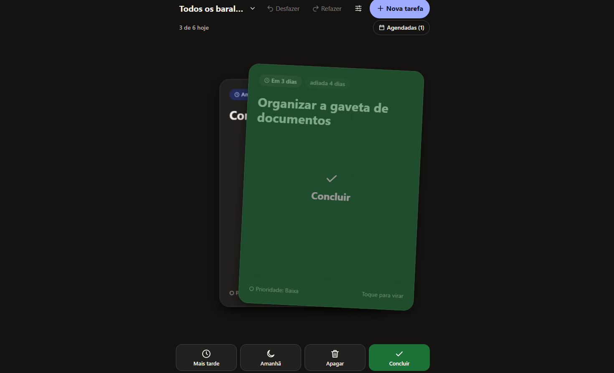
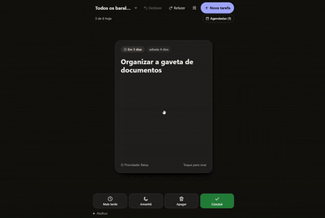
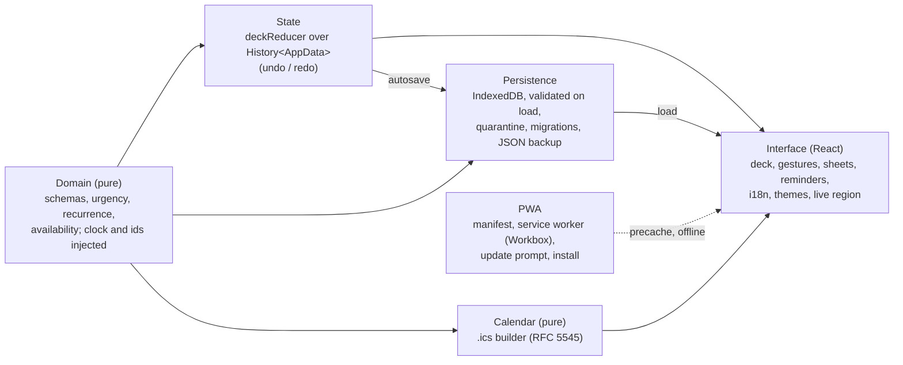

# taskdeck

A to-do app where your tasks are a deck of cards: one card at a time, swipe to decide.

**Demo: <https://taskdeck-flax.vercel.app>** · [](https://github.com/Name-Less-Dev/taskdeck/actions/workflows/ci.yml)

<p>
  
  
</p>

## Resumo em português

taskdeck é um app de tarefas em formato de baralho, mobile-first e 100% no navegador
(sem backend): uma carta por vez; deslize para a direita para concluir, para a esquerda
para "mais tarde", para baixo para "amanhã" e para cima para apagar, ou use os botões e
o teclado. Tem baralhos, tags, prazos e repetições, exportação para o calendário (.ics),
backup em JSON, seis temas e um tutorial, e funciona offline como app instalado.

## Highlights

- **Four actions, three ways**: swipe (right complete, left later, down tomorrow, up
  delete), the buttons in the thumb zone, or the keyboard; task and deck changes can
  be undone.
- **Installable PWA that works offline**: precached app shell; a new version waits
  for "Update" and never reloads on its own.
- **Pure domain with an injected clock**: no `Date.now()`, randomness or DOM in
  `src/domain` (enforced by ESLint), so every rule is tested with fixed dates.
- **Validated persistence**: IndexedDB records are checked against the domain schemas
  on load; invalid ones go to quarantine instead of disappearing.
- **Calendar export checked by an independent parser**: the `.ics` is parsed and its
  recurrences expanded by ical.js, and compared with the domain's own dates.
- **Tests in three layers**: unit and component tests (Vitest) and end-to-end tests on
  a real browser (Playwright, desktop and a Pixel 7 profile); CI runs the unit tests in
  three time zones.
- **Accessibility checked with axe** on the main screens in several themes, plus a
  WCAG contrast test over every colour pair of every theme.
- **Bilingual and themeable**: Portuguese and English, six themes, and a "How to use"
  tutorial with a practice deck that never touches your data.

## Try it

Open <https://taskdeck-flax.vercel.app>, choose "Load sample tasks" and swipe. Add
`?lang=en` for English and `?help=1` to open the tutorial.

### Install on your phone

- **Android (Chrome, Edge)**: Settings → App → **Install app** (or "Install app" in the
  browser menu).
- **iPhone/iPad (Safari)**: **Share → Add to Home Screen** (the app shows this tip in
  Settings, and it can be dismissed).
- Once installed it opens full screen and works without internet after the first
  visit. Your data stays on the device: export a backup now and then (Settings).

## How it's built



React 19, TypeScript 6 (strict), Vite 8, zod 4, date-fns 4, Motion, idb 8 and
vite-plugin-pwa (Workbox); Vitest, Testing Library, Playwright and axe for tests.

Five decisions:

1. **The domain is pure and the clock is a parameter**, so time-dependent rules are
   deterministic and tested in three time zones.
   → [domain decisions](docs/architecture.md#domain-design-decisions)
2. **A due date is wall-clock time** (`{ date, time? }`, no zone): 09:30 means 09:30
   wherever the device is, in the app and in the calendar file.
   → [calendar export](docs/calendar-ics.md)
3. **One visibility rule** (`isAvailable`) decides which cards are on the deck today:
   repeating cards wait for their day, snoozed cards for tomorrow; the due date never
   moves. → [domain decisions](docs/architecture.md#domain-design-decisions)
4. **Persistence is validated and never silently drops data**: quarantine, migrations,
   read-only mode for data from a newer version.
   → [persistence](docs/architecture.md#persistence-design)
5. **The service worker updates only when asked**, never over an open form.
   → [PWA](docs/architecture.md#pwa-design)

More: [features](docs/features.md) · [architecture](docs/architecture.md) ·
[browser support](docs/browser-support.md)

## Quality

| Layer | Runner | What it covers |
| --- | --- | --- |
| Unit | Vitest (`node`) | domain, reducer, storage (fake-indexeddb), calendar, gestures, themes and contrast, i18n parity |
| Component and integration | Vitest (`jsdom`) + Testing Library | screens, sheets, keyboard and focus, persistence through `Root` |
| End-to-end | Playwright (Chromium: desktop and Pixel 7) | real drags, layout at 320/360 px, offline, backup, `.ics`, themes, tutorial, axe |

```bash
npm install
npm run dev           # development server
npm test              # unit and component tests
npm run e2e           # end-to-end tests (builds and serves the production app)
npm run lint          # ESLint (type-checked)
npm run typecheck     # tsc for app, tooling and tests
npm run build         # production build with the service worker
```

Details, time zones and the debug panel: [testing](docs/testing.md) ·
[manual QA](docs/manual-qa.md)

## Bugs found and fixed

- **Enter submitted the task form** from a phone keyboard; Enter now moves to the next
  field and only the last one submits.
- **An invisible card froze the deck** (a layout row collapsed, and a reused card kept
  its exit position); the exit is now a state machine that always finishes.
- **A change made right before a reload was lost**; saves now commit their transaction
  explicitly. Found by an end-to-end test.

Root causes and fixes: [bugs](docs/bugs.md)

## Limitations

- No alerts when the app is closed: the only alarm outside the app is the one in an
  exported calendar event.
- Data lives only in this browser: no sync between devices, and iOS may delete the
  data of sites that are not installed (backups are the safety net).
- Tested on Chromium only; Safari/iOS and Firefox were not checked.
- Two open tabs: the last save wins.
- "Tomorrow" is the only snooze; there is no free date.

All of them: [limitations](docs/limitations.md)

## Roadmap

- Snooze until a chosen date.
- An animated "ghost" gesture in the tutorial and contextual tips.
- Colour per deck.
- Optional: an Android package (Capacitor) with system notifications.

How it was built, step by step: [project history](docs/history.md)
