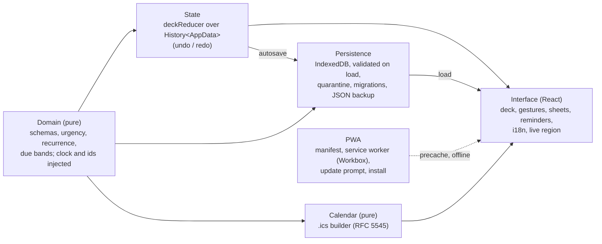

# taskdeck

A mobile-first to-do app where tasks are cards in a deck: swipe right to complete,
left to send the card to the bottom, up to delete, tap to see the back. It runs
entirely in the browser (installable PWA, works offline, no backend).

**Demo: <https://taskdeck-flax.vercel.app>** (deployed by Vercel from `main`).

**Current state: stage 5 done, the definition of done is reached and features are
frozen.** Installable and offline (service worker with an update prompt), end-to-end
tests with Playwright, metadata, an accessible HH:mm time field. Built on stage 4
(recurrence, deadline escalation, in-app reminders, `.ics` export), stage 3 (decks,
tags, editing, IndexedDB, JSON backup), stage 2 (card UI) and stage 1 (pure domain).
Stage 6 (Android packaging with system notifications) is optional and future.

> **Screenshot (pending):** `docs/screenshot-deck.png`, to be captured by hand on a phone.
>
> **Demo GIF (pending):** `docs/demo.gif`, to be recorded by hand (swipe right, left, up, undo).

## Resumo em português

taskdeck é um app de tarefas em formato de cartas (arrastar para concluir, adiar ou
apagar; tocar para ver o verso), mobile-first e 100% no navegador, sem backend.
Tem baralhos, tags, prazos com recorrência, avisos com o app aberto, exportação para o
calendário (.ics) com alarme e backup em JSON. A etapa 5 fecha o projeto: o app é
instalável e funciona offline (com aviso quando há versão nova, sem recarregar
sozinho), ganhou um campo de hora próprio (HH:mm) e testes de ponta a ponta com
Playwright. Demonstração: <https://taskdeck-flax.vercel.app>.

## Instalar no celular

- **Android (Chrome, Edge):** abra <https://taskdeck-flax.vercel.app>, vá em
  Configurações → App → **Instalar app** (ou no menu do navegador, "Instalar app").
- **iPhone/iPad (Safari):** toque em **Compartilhar → Adicionar à Tela de Início**. O
  app mostra essa dica em Configurações (dá para dispensar).
- Instalado, ele abre em tela cheia e funciona sem internet depois da primeira visita
  (Configurações mostra "Pronto para usar offline"). Quando sai uma versão nova, aparece
  "Nova versão disponível" com **Atualizar** e **Depois**; nada recarrega sozinho.
- Os dados ficam só no aparelho. Exporte um backup de vez em quando (Configurações).

## Features

- **Card deck** ordered by urgency (overdue → soon → today → tomorrow → this week →
  later → no due date). The top card is draggable; up to two more cards are drawn
  underneath.
- **Gestures**: right = complete, left = postpone to the end of the day, up = delete,
  tap = flip to the back. Coloured overlays with icon and text grow as you drag.
- **Same actions without gestures**: Postpone / Delete / Complete buttons in the thumb
  zone, Undo / Redo in the header, and keyboard shortcuts.
- **Undo** for every change (50 steps): task actions, edits, deck changes and
  imports, from the header, `Ctrl/⌘+Z`, or the toast (6 s, paused on hover/focus).
- **Decks**: the header button shows the active deck and opens the Decks sheet (all
  decks with active-task counts, "All decks", create, rename, delete with a
  confirmation that states how many tasks go with it; the last deck cannot be
  deleted). In "All decks", cards show their deck (when there is more than one).
- **Tags**: chips in the task form (Enter or comma adds, Backspace removes the last),
  up to 3 + "+N" on the card front and all on the back, and a filter bar with counts.
- **Editing**: "Edit" on the back of the card (or `E`) opens the same form,
  prefilled; recurring tasks keep their recurrence.
- **Persistence**: everything is saved in IndexedDB automatically; the app opens
  where you left it (active deck and language included).
- **Backup**: export a dated `.json` file and import it back (summary, confirmation,
  undo) from Settings.
- **Settings**: language (Automatic / Português / English), app (offline status, install), calendar export, persistent-storage status,
  last backup date, export/import, quarantined records.
- **Accessibility**: live region announcements, focus returned to the opener (or the
  deck) when sheets close, focus trapped in sheets, visible focus, AA contrast checked
  by a test, never colour alone, reduced-motion support.
- **Recurrence in the form**: a "Repeat" block (every N days/weeks/months, counted from
  the due date or from completion) to set, change or remove a task's repetition; a
  repeating task needs a due date. Cards show a short badge ("Toda semana") and the full
  rule on the back; completing one says "Done. Back on <date>" (undoable).
- **Deadline escalation**: border and background follow the band (soon amber, overdue
  red), always with an icon and text; "soon" pulses gently unless reduced motion is on.
- **In-app reminders**: when time moves a task into "soon" or "overdue" while the app is
  open, a discreet notice appears and is announced (grouped when several change; one
  summary after returning to a hidden tab; never repeated; Esc or button to dismiss).
- **Calendar export (.ics)**: "Calendar" on the back of a card exports that task;
  Settings exports every active task with a due date (or just the active deck), with
  an alarm setting (none, at the time, 15 min, 1 h, 1 day before; default 15 min).
- **Recurring cards only on their day**: a repeating card leaves the deck when it is
  completed and comes back on the day of its next date ("Done. Back on <date>").
  One-off tasks are never hidden, whatever their due date. The header reads "X of Y
  today"; "Scheduled (N)" opens a sheet with the waiting cards (next date, rule, deck;
  Complete now, Edit, Delete, all undoable). With nothing left for today the deck says
  "All done for today" (with a small CSS celebration, none with reduced motion) or
  "Nothing for today", with "Upcoming (N)". When the day changes with the app open
  (or on return to the tab), the cards that wake up are announced once.
- **Days of the week**: a weekly repetition can run on chosen days (Mon/Wed/Fri,
  weekdays, weekends...), with "First time: <date>" before saving; exported to
  calendars as `BYDAY`.
- **Themes**: Settings > Appearance offers Auto (follows the system, live), Dark,
  Light, Lilac, Pastel and Neon, each with a 3-colour swatch and its name; applied at
  once, announced, with "Restore default". No flash on load.
- **Collapsible tag filter**: "Filter by tag" opens the bar (collapsed by default,
  remembered per browser); an active filter shows an indicator and a dismissible
  "tag: X ×" chip.
- **Time field**: a 24 h "HH:mm" text field with a numeric keyboard (the native time
  picker was cut off on an Android phone): typing mask, "9:30" completed to "09:30" on
  leaving the field, the domain's validation (rejects 24:00, 12:60), and 09:00 / 12:00 /
  18:00 shortcuts. The date stays a native field.
- **After a calendar export** a notice says "File downloaded. Open it to add it to your
  calendar." (also announced).
- **Installable PWA, offline**: manifest and icons, a service worker that precaches the
  app, "Install app" in Settings (Chromium) or an iOS hint, "Ready to use offline" in
  Settings, and a "New version available · Update · Later" toast that never reloads on
  its own and never appears over an open sheet or form.
- **i18n**: pt-BR (default) and en; `?lang=en|pt-BR` in the address wins over the
  saved choice; `<html lang>` follows the language in use.

### Keyboard shortcuts (focus on the deck)

| Key | Action |
| --- | --- |
| `Enter` / `Space` | Flip the card |
| `E` | Edit the card |
| `→` | Complete |
| `←` | Postpone |
| `Delete` / `Backspace` | Delete |
| `Ctrl/⌘ + Z` | Undo |
| `Ctrl + Shift + Z` / `Ctrl + Y` | Redo |

## Stack

Vite + React 19 + TypeScript (strict, `noUncheckedIndexedAccess`), client-only, no SSR.
Domain: [zod](https://zod.dev) 4, [date-fns](https://date-fns.org) 4. UI:
[Motion](https://motion.dev) (`motion` package, imported from `motion/react`), CSS
Modules with CSS custom properties (light/dark), a small typed i18n dictionary.
Storage: [idb](https://github.com/jakearchibald/idb) 8. Tooling: Vitest (node + jsdom
projects) with V8 coverage, Testing Library,
[fake-indexeddb](https://github.com/dumbmatter/fakeIndexedDB) 6, ESLint (flat config)
with typescript-eslint in type-checked strict mode. PWA:
[vite-plugin-pwa](https://vite-pwa-org.netlify.app) 2.0 (Workbox 7.4) and
@vite-pwa/assets-generator 2.0 for the icons. End-to-end:
[Playwright](https://playwright.dev) 1.63 (Chromium) and @axe-core/playwright 4.13.

**Why idb and fake-indexeddb.** `idb` (by Jake Archibald) is a ~1 kB promise wrapper
that keeps IndexedDB's own semantics (real transactions, `tx.done` rejecting on
failure) and types the stores with a `DBSchema`; it hides nothing we need and adds no
abstraction of its own. `fake-indexeddb` is a pure-JavaScript, in-memory
implementation of the IndexedDB API that runs in Node and jsdom, follows the spec
closely (it is checked against the Web Platform Tests), and gives each test an
isolated database through `new IDBFactory()`. Both were checked against their current
documentation and the installed type definitions (idb 8.0.3, fake-indexeddb 6.2.5).

## Architecture



## Project structure

```
src/
  main.tsx              entry: error overlay (dev), ErrorBoundary, Root
  Root.tsx              opens storage, loads, then renders App / loading / read-only
  App.tsx               deck state, sheets, focus, announcements, autosave
  index.css             design tokens + light/dark
  domain/               pure domain core: schemas, dates, urgency, recurrence,
                        actions, decks (AppData), tags, updateTask, history
  state/deckReducer.ts  pure reducer over History<AppData>
  storage/              AppStorage interface, IndexedDB + memory implementations,
                        snapshot validation, migrations, autosaver, persistence,
                        JSON backup
  ui/                   gestures, formatting, form errors, tags, hooks
                        (useNow, useAutosave, usePersistence), download
  i18n/                 typed pt-BR and en dictionaries, locale resolution
  components/           Deck, TaskCard, ActionBar, UndoToast, Sheet, TaskFormSheet,
                        TagInput, TagFilterBar, DeckSheet, SettingsSheet,
                        StartupScreens, StorageBanner, EmptyState, LiveRegion, ...
  calendar/             pure .ics builder (RFC 5545)
  pwa/                  service worker registration (PwaProvider), install and
                        update decisions (pure), PWA context
  lib/id.ts             createId(): UUID v4 in any context
  dev/                  dev-only on-page error overlay
  demo/seed.ts          sample tasks (first run only, by explicit choice)
tests/                  node-environment tests (domain, state, storage, calendar, ui, pwa)
e2e/                    Playwright specs (production build, desktop + Pixel 7)
public/                 icon.svg and the generated PNG icons (committed)
pwa-assets.config.ts    icon generation (npm run icons)
playwright.config.ts
.github/workflows/ci.yml
```

## Scripts

Requires Node 24+ and npm.

```bash
npm install
npm run dev            # Vite dev server (add -- --host to open it from a phone)
npm test               # Vitest, once (node + jsdom projects)
npm run test:watch     # Vitest in watch mode
npm run test:coverage  # V8 coverage (fails under 90% lines in domain, state or storage)
npm run lint           # ESLint
npm run typecheck      # tsc --noEmit on app, tooling and test configs
npm run build          # type-check + production bundle in dist/ (with sw.js and the manifest)
npm run preview        # serve dist/ (the service worker only exists in this build)
npm run e2e            # Playwright: builds, serves on port 4173, runs desktop + mobile
npm run icons          # regenerate public/*.png from public/icon.svg (only when the SVG changes)
```

Playwright needs its Chromium once: `npx playwright install chromium` (on Linux CI:
`npx playwright install --with-deps chromium`, which also installs system libraries).

Tests default to `TZ=America/Sao_Paulo`. To run them in another zone, set `TZ`
(Linux/macOS: `TZ=Pacific/Auckland npm test`; Windows PowerShell:
`$env:TZ='Pacific/Auckland'; npm test`; Git Bash drops `TZ`). CI runs the suite in
`America/Sao_Paulo`, `UTC` and `Pacific/Auckland`, and logs the gzip size of the bundle.

## Data model

```ts
AppData = { decks: Deck[]; tasks: Task[] }   // invariants: >= 1 deck; every task.deckId exists
Deck    = { id; name }                       // 1-30 chars, trimmed, unique ignoring case
Task    = { id, deckId, title, description, tags, priority, due, recurrence,
            status, createdAt, completedAt, skippedAt, postponedDays }
Meta    = { schemaVersion: 1,
            settings: { activeDeckId: string | null, language: 'auto' | 'pt-BR' | 'en',
                        alarm: AlarmOption, installHintDismissed: boolean },
            lastBackupAt: ISO | null }
```

`checkIntegrity(data)` lists every broken invariant (no deck, duplicate ids, orphan
tasks). The undoable app state is `History<AppData>`; the active deck and the tag
filter are UI state outside the history (the active deck is saved in `Meta`, the tag
filter is per session).

## Persistence design

- **Interface.** `AppStorage { load(), save(data, meta), clear() }`, asynchronous, with
  two implementations: IndexedDB (stores `decks`, `tasks`, `meta`, `quarantine`) and
  memory (same interface, used as the fallback and in tests). The name avoids
  shadowing the DOM's `Storage` type.
- **One transaction per save.** `save` clears and rewrites decks and tasks and writes
  meta in a single readwrite transaction: all of it or none of it. It is committed
  explicitly (`tx.commit()`) as soon as every write is queued (see "Fixed bugs"). A request that
  fails synchronously (e.g. a value that cannot be cloned) aborts the transaction, so
  earlier writes in it never commit.
- **Validation on load, with quarantine.** Every record is validated with the domain
  schemas. Invalid ones are not dropped silently: they move to the `quarantine` store
  with the error, and the count is shown in Settings. If no deck is left, "Geral" is
  created; tasks whose deck is missing go to "Recuperadas" (same rule as imports).
- **Migrations.** `migrate(raw)` is pure and applies one registered step per version.
  The format is at v1, so the registry is empty, but the mechanism is tested with a
  fictional v0. A snapshot from a **newer** version is never loaded and never
  overwritten: the app opens read-only with a warning and can export the raw records.
- **Debounce and flush.** Changes are saved ~300 ms after the last one; saving
  happens immediately when the page is hidden (`visibilitychange`) or unloaded
  (`pagehide`). Saves never overlap. A failed save shows a discreet "Try again".
- **Persistent storage.** After the first user action, `navigator.storage.persist()`
  is requested if it exists (it only exists in secure contexts); Settings shows yes /
  no / unavailable.
- **Fallback.** If IndexedDB cannot be opened (private mode, blocked, quota, missing,
  or a hung open), the app runs on memory with a persistent warning; export still
  works.
- **First run.** An empty database offers "Load sample tasks" or "Start from scratch".
  Sample tasks only ever come from that button, never on top of saved data.

## Backup policy

Backups are plain JSON (`{ app: "taskdeck", schemaVersion, exportedAt, decks, tasks }`,
2-space indented) named `taskdeck-backup-YYYY-MM-DD.json` (local date). Exporting
records the date, shown in Settings as "Last backup". Importing validates the file
and reports distinct errors (not JSON, not a taskdeck backup, newer version, invalid
field with its path, duplicate ids); tasks whose deck is missing go to "Recuperadas"
with a warning. The import shows a summary, asks for confirmation, replaces all data,
and can be undone during the session. Because browsers may evict local data,
exporting a backup now and then is the recommended safety net.

## Project decisions (summary)

- **Pure domain with an injected clock.** `src/domain` and `src/calendar` never read
  the time, randomness or the DOM (ESLint enforces it); `now` and ids are parameters,
  so every rule is tested with fixed dates in three time zones.
- **A due date is wall-clock time** (`{ date, time? }`, no zone): "09:30" means 09:30
  wherever the device is, in the app and in the exported `.ics` (floating times).
- **Validated persistence with quarantine.** Every record loaded from IndexedDB or a
  backup goes through the domain schemas; invalid ones are kept aside and counted,
  never silently dropped; newer formats open read-only.
- **The `.ics` is checked by an independent parser** (ical.js), including rule
  expansion against the domain's own `nextDue`.
- **Service worker updates only on request.** A new version waits; the user chooses
  "Update" (never while a sheet or form is open). No automatic reload, no lost input.

## PWA design

- **vite-plugin-pwa 2.0.0** was checked first: its peer range includes Vite 8 (`^3 ... ^8`)
  and it uses Workbox 7.4.1 (`workbox-build`, `workbox-window`), so no hand-written
  worker was needed. Strategy `generateSW`.
- **Precache** of every built file (`js, css, html, ico, png, svg, webmanifest`; the
  plugin's default is only js/css/html) and a **navigation fallback** to `index.html`,
  so `/?lang=en` also opens offline. No runtime caching: the app calls no other origin.
- **Production only.** `devOptions` stay off: `npm run dev` has no service worker
  (and `http://<LAN IP>` is not a secure context anyway); use `npm run preview` or
  the Vercel URL.
- **Update by prompt.** `registerType: 'prompt'`; `useRegisterSW` (from
  `virtual:pwa-register/react`) reports `needRefresh`; "Update" calls
  `updateServiceWorker(true)`, which activates the new worker and reloads. The pure
  `shouldOfferUpdate` hides the toast while a sheet is open.
- **Offline status.** "Ready to use offline" once `navigator.serviceWorker.ready`
  resolves with an active worker (its install step, the precache, has finished).
- **Install.** `beforeinstallprompt` (Chromium only) is captured at load and offered as
  "Install app" in Settings; iOS Safari has no such event, so it gets a dismissible
  "Share > Add to Home Screen" hint (dismissal saved in settings). Nothing shows in
  standalone mode (`display-mode: standalone` or `navigator.standalone`). The choice is
  the pure `decideInstallUi`, tested as a table.
- **Manifest**: name/short_name "taskdeck", Portuguese description and `lang`,
  `start_url`/`scope` "/", `standalone`, `background_color`/`theme_color` read from
  `--color-bg` in `src/index.css` at build time; `<meta name="theme-color">` for
  light and dark (a test keeps them equal to the tokens).
- **Icons**: `public/icon.svg` (two stacked cards, the top one checked) rendered with
  @vite-pwa/assets-generator (`minimal-2023` preset: 64/192/512, maskable 512 on the
  accent colour, apple-touch-icon 180, favicon.ico). The PNGs are committed.

## UI design decisions

- **The swipe decision is pure.** `decideSwipe` turns offset/velocity/size into an
  action (30% of the width, 22% of the height upwards, or a 500 px/s flick with 40 px
  of travel; ambiguous diagonals and downward swipes do nothing).
- **Tap vs drag.** A drag starts only after 8 px of movement.
- **The gesture is never the only way.** Buttons, keys and swipes share
  `requestAction`: exit animation first, reducer action after.
- **Shared sheet.** Every sheet uses one dialog component (focus trap, Escape,
  `aria-modal`, `inert` page behind it); focus returns to the button that opened it.
- **No nested controls.** The card is a `role="button"`; the Edit button sits next to
  it in the DOM (over the back of the card), never inside it.
- **The toast lives outside the page shell**, so "Undo" stays usable above a sheet.
- **Dynamic badges** recompute from `useNow` (30 s tick + `visibilitychange`).
- **The domain stays text-free**; names it must create ("Geral", "Recuperadas") come
  from the dictionary of the current language.

## Domain design decisions

- **Injected clock and ids**, enforced by ESLint inside `src/domain`.
- **Structured results, no UI text.**
- **Immutability.** Functions never modify their arguments; tests deep-freeze inputs.
- **Due dates are wall-clock time** (`{ date, time? }`, no zone); a date-only due is
  due at the end of that local day.
- **Calendar-day arithmetic** (`differenceInCalendarDays`).
- **Urgency bands** with a total order: band, priority, due, `createdAt`, id.
- **Postpone lasts until the end of the day**; `postponedDays` counts days, not swipes.
- **Recurrence anchors** `'due'` (fixed schedule, skips missed occurrences) and
  `'completion'` (restarts from today); monthly `'due'` keeps `originDay`.
- **One visibility rule: `isAvailable(task, now)`.** It is the only function that
  decides whether a card is on the deck; the deck, the counts, the tag counts, the
  reminders and the rollover announcement all go through it (and so will a future
  "postpone to tomorrow"). A task is available when it is active and, **only if it
  repeats**, when its due date is today or earlier (overdue repeating cards stay). A
  one-off task with a future due date stays visible: a deadline is something to work
  towards, while a repeating card is "for that day". `availableTasks`,
  `dormantTasks` (the waiting repeating cards, soonest first) and `dailyProgress`
  build on it.
- **Daily progress**: `done` = tasks whose `completedAt` falls on the local day of
  `now` (one-off and repeating); `remaining` = available tasks. The header shows
  "done of done + remaining today" for the active deck (the tag filter does not change
  it).
- **On the card**, a repeating task with a date only reads "Today" or "Pending for N
  days" in a neutral style (no red, no pulse); with a time it keeps the deadline
  escalation. This mapping is presentation (`presentDue`); `getDueStatus` is unchanged.
- **Days of the week** (`recurrence.weekdays`, 0 = Sunday like `getDay`, sorted, no
  repeats, not empty) only exist for a fixed calendar: unit `week`, every 1, anchor
  `due`; any other combination is rejected by the schema. The due date moves to the
  first valid day (time kept) on create and edit; the next date is the first valid day
  strictly after max(due date, today), so missed days are skipped and completing early
  moves on from the due date. Additive field: `schemaVersion` stays 1 and older data
  loads unchanged.
- **Decks and edits.** `createDeck`/`renameDeck` reject duplicate names ignoring case;
  `removeDeck` removes the deck and its tasks and refuses the last one; `updateTask`
  edits title, description, tags, priority, due, deck and recurrence (with its invariants), keeping
  counters (and refuses to drop the due date of a recurring task).

## Testing notes

Test pyramid (counts after the themes package):

| Layer | Runner | Tests |
| --- | --- | ---: |
| Unit (domain, state, storage, calendar, ui logic, i18n, pwa, themes and contrast) | Vitest, `node` project | 864 |
| Component and integration (React, jsdom, fake-indexeddb) | Vitest, `dom` project | 234 |
| End-to-end (production build, real Chromium) | Playwright, `desktop` + `mobile` (Pixel 7) | 39 × 2 = 78 (2 skipped by design: the shortcuts legend is checked per project) |

End-to-end specs (`e2e/`): layout (no horizontal scroll at 320 and 360 px, light and
dark, in first run, deck, form, decks sheet and settings), gestures with real mouse
drags (right, left, up with Undo, a short drag that springs back), form (Enter flow,
time field, recurrence without a date), persistence (reload, active deck, language),
backup (export, import into a fresh context, invalid file), calendar (`.ics`
download: CRLF, SUMMARY, DTSTART, notice), offline (reload with the network off,
create and keep a task), accessibility (axe, failing on serious/critical, both
themes; no rule disabled and no exception needed), i18n (`?lang=en`, `<html lang>`),
and an overdue reminder using Playwright's controlled clock (`page.clock`). Each test
gets a fresh browser context (empty IndexedDB) and starts from the first-run screen;
there are no fixed waits. "Clearing the site data" in the backup spec is a new
context, which has its own empty storage.

- Pure logic (domain, reducer, storage with fake-indexeddb, backup, gestures,
  formatting, dictionary parity, colour contrast) runs in the `node` project;
  components, hooks and end-to-end flows run in the `dom` project (jsdom).
- End-to-end persistence tests render `Root` on one fake IndexedDB and "reload" by
  unmounting and rendering again.
- **Dragging is not simulated in jsdom**; the decision is covered by `decideSwipe`
  and every action through buttons and keys. Real drags run in Playwright.
- Component tests fake only `Date` and build dates with local constructors, so they
  pass in every CI time zone.
- **Layout (horizontal overflow) cannot be tested in jsdom**, which computes no layout.
  Stage 3 shipped a regression that made the app wider than a 360 px phone. Playwright
  now asserts `document.documentElement.scrollWidth <= clientWidth` at 320 and 360 px
  in the main states. To check by hand in DevTools at a phone width, this lists every
  element that sticks out on the right:
  `[...document.querySelectorAll('*')].filter(e => e.getBoundingClientRect().right > innerWidth + 1)`.

## Fixed bugs worth remembering

- **Enter in the task form created the task** (stage 3). The virtual keyboard's
  action key sends Enter, and Enter in a single-line field implicitly submits a
  `<form>`; `enterkeyhint` only changes the key's label. The form now handles Enter:
  next field in single-line fields, submit on the last one (time), new line in the
  description, Ctrl/Cmd+Enter submits anywhere, nothing while an IME is composing.
- **Invisible card / "frozen" deck after creating cards in the form** (stage 3), two
  independent causes, both reproduced before fixing:
  1. *Layout.* The shell was a 3-row grid (`auto 1fr auto`); stage 3 added more rows
     (tag bar, banners), so as soon as a task had tags (only possible through the
     form) the flexible row went to the tag bar, `<main>` collapsed to its padding,
     the deck area had 0 height and the card spilled over the action bar; `focus()`
     then scrolled the `overflow: hidden` shell and pushed the header off-screen.
     Measured at 360x740: rows 72/509/32/127 px, shell scrollTop 285. Fix: a flex
     column where only `<main>` grows, `overflow: clip`, card capped to the deck area.
  2. *Motion values.* The exit animation leaves the card off-screen with opacity 0.
     A postponed (or completed recurring) task keeps the same card instance, so it
     came back to the top invisible and ~1200 px away: drags hit nothing, only the
     buttons worked. Fix: reset x/y/opacity when the exit ends. Also, an exit
     interrupted because the card lost the top never ended and blocked every action;
     the exit is now a pure state machine (`src/ui/exitState.ts`) that always commits
     (finished, interrupted, or after a 600 ms safety-net timeout).

- **A change made right before a reload was lost** (found by the stage 5 Playwright
  persistence test). Saves are debounced by 300 ms and flushed on `pagehide`, but in
  Chromium the flushed transaction never committed before the page went away (with
  1 s of wait the test passed). Fix: `tx.commit()` once every write is queued, with a
  unit test that the commit happens and the e2e test as the reproduction.

### Gesture and viewport debug panel (development only)

Open the dev server with `?debug=gestures` (e.g. `http://<LAN IP>:5173/?debug=gestures`)
to get a live panel: last pointer events and targets, top card id, flipped / exiting /
busy flags, drag offset and the `decideSwipe` result, exit animation status and age,
inner/visual viewport sizes (and innerHeight changes), inert elements, the top card's
opacity/transform/on-screen state, renders per second and a heartbeat delay. Reading
it: high heartbeat delay = main thread blocked; normal heartbeat but stuck UI = a
lock, `inert` or an overlay; "exit started" for more than 1 s = exit never finished;
innerHeight changing near the problem = viewport/keyboard; `pointercancel` during a
drag = the browser took the touch; pointerdown without "drag ON" = drag controls on
the wrong element; top card opacity 0 or OFF-SCREEN = the card is there but invisible.
The panel never intercepts touches and is not part of production builds.

## Verified manually

Only what has actually been seen on a device:

- An exported `.ics` event imported into the calendar app of an Android phone, with
  its time, a daily repetition and an alarm; **the alarm fired**.

Everything else in the scripts below is still unchecked.

## Manual QA on a phone

The checklists below need a real device. Run `npm run dev -- --host`, then open the
"Network" URL Vite prints (e.g. `http://192.168.0.10:5173`) on a phone on the same
Wi-Fi. On Windows, allow Node.js through the firewall for private networks when asked.

**`http://<LAN IP>` is not a secure context.** Browsers only treat HTTPS and
`localhost` as secure, so on the phone over plain HTTP: `crypto.randomUUID` does not
exist (ids come from `createId()`, which falls back to `getRandomValues`), there is no
service worker and no PWA install, and `navigator.storage` (persistent storage) is
missing, so Settings shows "unavailable". IndexedDB itself works. **PWA and
persistent-storage testing require HTTPS**: use the Vercel URL. In
development, uncaught errors are printed on the page by a small overlay.

Gestures and layout:

- [ ] Swipe right, left and up: overlay grows with the distance, card leaves, action applies
- [ ] Release before the threshold: card springs back, nothing happens
- [ ] Short fast flick in each direction triggers the action
- [ ] Tap flips the card; a tiny accidental move still counts as a tap
- [ ] Undo from the toast, the header button and (with a keyboard) `Ctrl+Z`
- [ ] The page does not scroll or bounce while dragging; no pull-to-refresh
- [ ] Dragging from the middle of the card does not trigger the system "back" gesture
- [ ] The on-screen keyboard does not cover the fields of the task form
- [ ] Dark mode (system setting) looks right and stays readable
- [ ] Rotating the screen keeps the layout usable
- [ ] Cards created through the form, with long content (long title and description, many tags, high priority already overdue) and with the virtual keyboard open: the card is visible, can be dragged and flipped, and the deck keeps working after several actions in a row (use `?debug=gestures`)
- [ ] In the task form, the keyboard action key goes to the next field (title → description...) and only the last field submits
- [ ] No horizontal scrolling or cut-off content at 320, 360 and 390 px wide (empty deck, cards, every sheet open, toast visible, settings), in light and dark themes and with the system text size enlarged
- [ ] Screen reader (TalkBack / VoiceOver): card name, flip state, actions and
      announcements are read

Calendar and reminders script:

- [ ] Export one task (back of the card) and all tasks (Settings) and open the downloaded `.ics` from the phone's downloads
- [ ] Import it into the phone's calendar app (Google Calendar or Apple Calendar): the time is the one shown in the app, the all-day tasks are all-day, the alarm fires at the chosen time (09:00 for all-day), and a weekly task repeats
- [ ] Import the same file again: events are updated, not duplicated
- [ ] A monthly task on the 31st repeats on the last day of shorter months; one on the 30th shows only the next date with the note
- [ ] Change the phone's clock (or wait) to cross a deadline with the app open: the card changes to soon/overdue and the reminder appears once
- [ ] Complete a recurring task: "Done. Back on <date>", the card leaves the deck and is listed in "Scheduled", Undo restores it
- [ ] Leave the app open past midnight (or come back the next day): the repeating card is back and "New cards for today" is announced once
- [ ] Pick Mon/Wed/Fri in the form: "First time" shows the right day, and the calendar app repeats on those days only
- [ ] Phone: the shortcuts legend is not shown; the tag filter opens and closes and stays as left after a reload

PWA and time field script (on <https://taskdeck-flax.vercel.app>):

- [ ] Android Chrome: Settings → "Install app" installs it; the icon (maskable) looks right on the home screen; it opens standalone, and the install button is gone there
- [ ] iPhone Safari: the "Share > Add to Home Screen" hint appears, "Dismiss tip" hides it for good; installed, the apple-touch-icon is used
- [ ] After one visit, airplane mode, reopen the installed app: it opens, and tasks can be created and are kept
- [ ] Settings shows "Ready to use offline"
- [ ] Deploy a new version: "New version available" appears (not over an open form); "Later" hides it; "Update" reloads into the new version
- [ ] The time field opens the numeric keyboard, "0930" becomes "09:30", the shortcuts work, and nothing is cut off at 320 px
- [ ] Theme colour of the browser bar follows light/dark

Persistence script:

- [ ] Create a task, reload the page: the task is there
- [ ] Switch to another deck and change the language, reload: both are kept
- [ ] Create a task and immediately close the tab; reopen: the task is there
- [ ] Turn on airplane mode, create/complete tasks, reload: everything is kept (no network is used)
- [ ] Settings → Export backup: a `taskdeck-backup-YYYY-MM-DD.json` file is downloaded and "Last backup" updates
- [ ] Clear the site data in the browser settings, reopen: first-run screen
- [ ] Settings → Import the exported file: summary, confirmation, data back; Undo works
- [ ] Private/incognito window: the "data will not be saved" warning appears and export works

## Browser support

The build uses Vite 8's default target (Chrome/Edge 111, Firefox 114, Safari/iOS 16.4).
Vite down-compiles syntax but does not polyfill APIs or CSS. Newer features in use:

| Feature | Where | Notes |
| --- | --- | --- |
| `crypto.randomUUID` | `src/lib/id.ts` only | Secure contexts only; falls back to `getRandomValues` |
| `navigator.storage.persist` | persistence status | Secure contexts only; reported as unavailable otherwise |
| IndexedDB | storage | Falls back to memory when it cannot be opened |
| `Array.prototype.with` | `domain/actions.ts` (`upsertTask`) | Firefox 115+, one version above the target |
| `Array.prototype.at` | sheet focus trap | Safari 15.4+, Firefox 90+ |
| `inert` attribute | stacked cards, page behind sheets | Safari 15.5+, Firefox 112+; also backed by `aria-hidden`/`tabIndex` |
| CSS `:has()` | selected priority in the form | **Firefox 121+**: on 114-120 the selected option is not highlighted |
| CSS `dvh` units | app shell, card, sheets | Each preceded by a `vh` fallback |
| `structuredClone` | memory storage | Chrome 98+, Safari 15.4+, Firefox 94+ |
| `Blob.text()` | backup import | Widely available |
| Service worker, Web App Manifest | PWA | Secure contexts only (HTTPS, localhost); none in `npm run dev` |
| `beforeinstallprompt` | "Install app" | Chromium only; iOS Safari gets a hint, Firefox nothing |
| `display-mode: standalone`, `navigator.standalone` | hide install UI when installed | `navigator.standalone` is iOS only |

## Calendar export (.ics) design

Checked against RFC 5545 (sections 3.1, 3.3.5, 3.3.10, 3.3.11, 3.6.1, 3.6.6, 3.8.1.9,
3.8.4.7, 3.8.6.3, 3.8.7.2) before writing the builder (`src/calendar/ics.ts`, pure).

- **VEVENT, not VTODO.** Phone calendar apps show and alert on events; most ignore
  VTODO. The trade-off: the calendar does not know the task is "done", and completing a
  task does not remove it there (export again to update it).
- **Stable UID** `<task id>@taskdeck`: importing again updates the event instead of
  duplicating it (in apps that honor UID). **DTSTAMP** is the export time, in UTC.
- **Floating local time.** A due with a time becomes `DTSTART:20261007T093000` (no `Z`,
  no `TZID`) lasting 15 minutes: "09:30 wherever the device is", the same wall-clock
  meaning as in the app. A date-only due becomes an all-day event (`VALUE=DATE`).
- **Alarms** are `DISPLAY` alarms relative to the start (`-PT15M`, `-PT1H`, `-P1D`, `PT0S`).
  For all-day events relative triggers count from 00:00 of the day, so the alarm is set
  for 09:00 of the day (`PT9H`), or 09:00 of the day before for "1 day" (`-PT15H`).
- **PRIORITY** 1 / 5 / 9 for high / medium / low (RFC: 1-4 high, 5 medium, 6-9 low).
- **Days of the week** become `RRULE:FREQ=WEEKLY;BYDAY=MO,WE,FR` (INTERVAL defaults to
  1, the only interval allowed with days); DTSTART is the first valid day. ical.js
  expands 8 weeks of them exactly like the domain.
- **Recurrence.** Due-anchored repetitions become `RRULE:FREQ=DAILY|WEEKLY|MONTHLY;INTERVAL=n`.
  Monthly: day 1-28 `BYMONTHDAY=n`; day 31 `BYMONTHDAY=-1` (the last day, which is exactly
  "31, or the last day of a shorter month"). For days 29 and 30 the RFC-exact form
  (`BYMONTHDAY=28,..,n;BYSETPOS=-1`) exists, but ical.js ignores `BYSETPOS` there and
  would create several events a month, so those export **only the next date**, with a
  note in the description. Repetitions counted **from completion** have no calendar
  equivalent: only the next date is exported, and the description says so.
- **Format**: CRLF line ends, folding at 75 octets that never splits a UTF-8 character
  (accents, emoji), TEXT escaping of backslash, `;`, `,` and newlines, events ordered by task id.
- **Validation with an independent parser**: [ical.js](https://github.com/kewisch/ical.js)
  (devDependency, v2.2.1; maintained by the Thunderbird calendar maintainer, ships
  TypeScript types) parses a varied sample and every field must match: text with
  special characters, start, duration, all-day dates, alarm, priority, categories and
  rules. It also expands the rules, and the dates are compared with the domain's own
  `nextDue`. It is what revealed the `BYSETPOS` problem above.

## Reminders design

Reminders work **only while the app is open** (the service worker only caches the
app; there are no system notifications). `diffDueBands` (domain) compares each task's urgency band with the
previous snapshot as the clock ticks (`useNow`: every 30 s and when the tab becomes
visible); `src/ui/reminders.ts` applies the rules: nothing on load, grouped changes,
one summary for what changed while the tab was hidden, no repeats for the same task
and band, and no reminder for a change caused by editing the due date.

## Themes

- **Model** (`src/ui/theme.ts`, pure): `Theme = auto | dark | light | lilac | pastel | neon`,
  default `auto`. `parseTheme` turns anything stored (missing, broken, unknown) into a
  valid theme without throwing; `resolveTheme(theme, systemPrefersDark)` turns `auto`
  into `light` or `dark`.
- **Tokens**: `src/index.css` has exactly one block per theme, `[data-theme='x']`,
  defining every colour token, the shadows and `color-scheme` (light or dark, so the
  native date picker and scrollbars match). `data-theme` on `<html>` always holds the
  resolved theme (`data-theme-choice` keeps `auto`); nothing depends on
  `prefers-color-scheme` in CSS any more. **Light and dark are exactly the colours from
  before themes** (a test pins them), so nothing changes for anyone who does not
  choose. The swatches in Settings use the same blocks on a nested element.
- **Pastel** colours tags and the deck badge with six fixed pastel hues, picked by a
  stable hash of the text (`tagHue`, FNV-1a), always with dark text. A selected tag keeps
  the accent colour so selection stays obvious.
- **Neon**: near-black base, cyan accent, lime focus, magenta delete. The glow
  (`box-shadow`) only reinforces the focus outline and selected controls; it is never
  the only indicator, there is no `text-shadow`, and the "soon" pulse stays off with
  reduced motion (as in every theme).
- **Semantics** (overdue, soon, done, delete) keep their hue family and the icon + text
  pair in every theme; every pair passes AA (see Testing notes).
- **No flash**: the choice lives in `localStorage` under one key
  (`taskdeck:ui:theme`, JSON), read by a small synchronous script at the top of
  `<head>`, before the CSS and the bundle (unavailable storage = auto). It is never
  stored in IndexedDB or in backups. A test runs that exact script against
  `parseTheme`/`resolveTheme`; Playwright checks the attribute is there even with every
  script file blocked.
- **At runtime** `useTheme` applies changes at once, follows the system for `auto`, and
  points every `<meta name="theme-color">` at the theme's background.
- **Limits**: the manifest's `theme_color`/`background_color` are static (light), so
  the splash screen of the installed app does not follow the theme. The theme is per
  browser (not synced, not in backups). Dark keeps its previous warm graphite tones
  rather than a new neutral palette, to keep "nothing changes" true.

## Interface preferences

Choices about the interface itself (for now: whether the tag filter is open) are kept
**per browser in `localStorage`** (`taskdeck:ui:*`, `src/ui/preferences.ts`), never in
IndexedDB and never in backups. Every access is guarded: if storage is blocked or
missing, the default applies and the choice lasts for the session.

The keyboard shortcuts legend only shows with `(hover: hover) and (pointer: fine)`
(a mouse or trackpad); on touch devices it is `display: none`, which also removes it
from the accessibility tree. The shortcuts keep working with a keyboard.

## Known limitations

- **"Today" is the local civil day** of the device (midnight to midnight). There is no
  configurable start of the day (e.g. 4:00 for night owls): a card completed at 00:30
  counts for the new day.
- **No history or streaks**: progress counts only today's completions; there is no
  record of past days and no streak counter.
- **Days of the week only every 1 week, on a fixed calendar** (anchored on the due
  date). "Every 2 weeks on Monday" or "from completion" with days are not supported.
- **Hidden repeating cards are counted per deck**: "Scheduled (N)" and the progress
  follow the active deck; the tag filter only affects the deck itself.
- **Alarms only through the calendar app.** taskdeck cannot alert when it is closed;
  the only alarm outside the app is the one in an imported `.ics` event.
- **Reminders only with the app open** (and visible; a hidden tab gets one summary when
  it comes back).
- **iOS may delete the data of sites that are not installed** after a while without
  use (and private modes delete it when closed). Installing the app and exporting
  backups are the mitigations.
- **No sync between devices**; moving data means export + import.
- **Native date pickers**: the date field is the browser's own and looks different on
  each platform (only the time field was replaced).
- **Safari/iOS and Firefox are not tested**: Playwright runs Chromium only, and no
  manual check has been done in them.
- **The undo history is not saved.** Reloading keeps the data but forgets what can be
  undone.
- **Two tabs: the last write wins.** Each tab saves its full snapshot; changes made in
  one tab are overwritten by the other's next save. There is no cross-tab sync yet.
- Persistent storage is only available in secure contexts and the browser may refuse
  it; the status is shown in Settings.
- The bundle is about 182 kB gzip (JS 180 + workbox-window 2.2; CSS 5.4). Motion's
  `LazyMotion` and code-splitting the sheets could cut it.
- `og:image` points to `/og.png` (1200x630), which does not exist yet: link previews
  show no image until it is made (see "Pending").
- **DST.** Wall-clock due dates follow the device's zone. A local time that does not
  exist (the hour skipped when DST starts) or happens twice is resolved by JavaScript
  `Date` in the app, and by each calendar app for the floating times in the `.ics`
  (usually the next valid time / the first occurrence). Not specifically tested.
- **Monthly on the 29th or 30th** exports only the next date to calendars (see the
  calendar design above); the 31st exports as "last day of the month". Inside the app
  all of them repeat correctly.
- An `.ics` with no task has no event, which parsers accept but the RFC grammar does
  not (it asks for at least one component), so the app never offers that download.
- Exported events are snapshots: completing, editing or deleting a task in the app does
  not change the calendar until the file is exported and imported again.
- Monthly recurrences anchored on `'completion'` use plain month addition (31 Jan →
  28 Feb → 28 Mar).

## Pending (manual, not code)

- [ ] `public/og.png` (1200x630) for link previews (`og:image`, `twitter:image` already point to it)
- [ ] `docs/screenshot-deck.png`: a real screenshot of the deck on a phone
- [ ] `docs/demo.gif`: a short recording of the gestures
- [ ] The manual QA scripts above

## Roadmap

1. Domain core (done)
2. Card UI with gestures, buttons/keyboard and undo (done)
3. Decks, tags, editing, local persistence and JSON backup (done)
4. Due dates and recurrence in the UI, in-app reminders, `.ics` export (done)
5. Installable PWA, offline, update prompt, HH:mm time field, Playwright end-to-end tests, metadata, deploy (done)
6. Behaviour package 1 (done): shortcuts legend on pointer devices only, collapsible tag filter, repeating cards only on their day with a Scheduled sheet and daily progress, days of the week in recurrences

Next (not started):

- **"Postpone to tomorrow"**: its own field (e.g. `hiddenUntil`), checked inside
  `isAvailable`, never touching the due date.
- **Colour per deck**.
- Optional: Capacitor/Android packaging with local (system) notifications.
