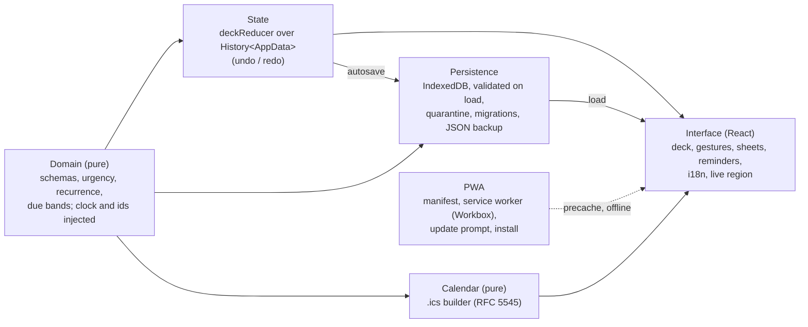

# Architecture and design decisions

[← Back to the README](../README.md)

## Stack

Vite 8 + React 19 + TypeScript 6 (strict, `noUncheckedIndexedAccess`), client-only,
no SSR. Domain: [zod](https://zod.dev) 4, [date-fns](https://date-fns.org) 4. UI:
[Motion](https://motion.dev) (`motion` package, imported from `motion/react`), CSS
Modules with CSS custom properties (one token block per theme, six themes), a small
typed i18n dictionary.
Storage: [idb](https://github.com/jakearchibald/idb) 8. Tooling: Vitest (node + jsdom
projects, Vitest 5) with V8 coverage, Testing Library,
[fake-indexeddb](https://github.com/dumbmatter/fakeIndexedDB) 6, ESLint (flat config)
with typescript-eslint in type-checked strict mode. PWA:
[vite-plugin-pwa](https://vite-pwa-org.netlify.app) 2.0 (Workbox 7.4) and
@vite-pwa/assets-generator 2.0 for the icons. End-to-end:
[Playwright](https://playwright.dev) 1.63 (Chromium) and @axe-core/playwright 4.13.

**Why idb and fake-indexeddb.** `idb` (by Jake Archibald) is a ~1 kB promise wrapper
that keeps IndexedDB's own semantics (real transactions, `tx.done` rejecting on
failure) and types the stores with a `DBSchema`; it hides nothing we need and adds no
abstraction of its own. `fake-indexeddb` is a pure-JavaScript, in-memory
implementation of the IndexedDB API that runs in Node and jsdom, follows the spec
closely (it is checked against the Web Platform Tests), and gives each test an
isolated database through `new IDBFactory()`. Both were checked against their current
documentation and the installed type definitions (idb 8.0.3, fake-indexeddb 6.2.5).

## Architecture



## Project structure

```
src/
  main.tsx              entry: error overlay (dev), ErrorBoundary, Root
  Root.tsx              opens storage, loads, then renders App / loading / read-only
  App.tsx               deck state, sheets, focus, announcements, autosave
  index.css             design tokens: one block per theme (auto resolves to light/dark)
  domain/               pure domain core: schemas, dates, urgency, recurrence,
                        weekdays, availability, actions (incl. snooze), decks
                        (AppData), tags, updateTask, due bands, history
  state/deckReducer.ts  pure reducer over History<AppData>
  storage/              AppStorage interface, IndexedDB + memory implementations,
                        snapshot validation, migrations, autosaver, persistence,
                        JSON backup
  ui/                   gestures, keys, formatting, form errors, tags, themes,
                        reminders, rollover, preferences, time field, hooks
                        (useNow, useAutosave, usePersistence, useTheme,
                        useDueReminders, useFinePointer), download
  i18n/                 typed pt-BR and en dictionaries, locale resolution
  components/           Deck, TaskCard, ActionBar, UndoToast, ReminderToast,
                        UpdateToast, Sheet, TaskFormSheet, TagInput, TagFilterBar,
                        DeckSheet, SettingsSheet, ThemePicker, ScheduledSheet,
                        HowToSheet, PracticeDeck, StartupScreens, StorageBanner,
                        EmptyState, LiveRegion, ...
  calendar/             pure .ics builder (RFC 5545)
  pwa/                  service worker registration (PwaProvider), install and
                        update decisions (pure), PWA context
  lib/id.ts             createId(): UUID v4 in any context
  dev/                  dev-only on-page error overlay
  demo/seed.ts          sample tasks (first run only, by explicit choice)
tests/                  node-environment tests (domain, state, storage, calendar, ui, pwa)
e2e/                    Playwright specs (production build, desktop + Pixel 7)
public/                 icon.svg and the generated PNG icons (committed)
pwa-assets.config.ts    icon generation (npm run icons)
playwright.config.ts
.github/workflows/ci.yml
```

## Data model

```ts
AppData = { decks: Deck[]; tasks: Task[] }   // invariants: >= 1 deck; every task.deckId exists
Deck    = { id; name }                       // 1-30 chars, trimmed, unique ignoring case
Task    = { id, deckId, title, description, tags, priority, due, recurrence,
            status, createdAt, completedAt, skippedAt, postponedDays,
            snoozedUntil }                   // snoozedUntil: DayKey | null (default null)
Due     = { date: 'YYYY-MM-DD', time?: 'HH:mm' }
Recurrence = { unit: 'day' | 'week' | 'month', every, anchor: 'due' | 'completion',
               originDay?,                   // monthly + due only
               weekdays? }                   // 0-6, weekly + every 1 + due only
Meta    = { schemaVersion: 1,
            settings: { activeDeckId: string | null, language: 'auto' | 'pt-BR' | 'en',
                        alarm: AlarmOption, installHintDismissed: boolean,
                        tutorialSeen: boolean },
            lastBackupAt: ISO | null }
```

`checkIntegrity(data)` lists every broken invariant (no deck, duplicate ids, orphan
tasks). The undoable app state is `History<AppData>`; the active deck and the tag
filter are UI state outside the history (the active deck is saved in `Meta`, the tag
filter is per session). Fields added after the first format (`snoozedUntil`,
`weekdays`, the settings with defaults) are additive: `schemaVersion` stays 1 and older
data and backups load unchanged. The theme and the tag-filter state are interface
preferences in `localStorage`, outside `Meta` and backups.

## Project decisions (summary)

- **Pure domain with an injected clock.** `src/domain` and `src/calendar` never read
  the time, randomness or the DOM (ESLint enforces it); `now` and ids are parameters,
  so every rule is tested with fixed dates in three time zones.
- **A due date is wall-clock time** (`{ date, time? }`, no zone): "09:30" means 09:30
  wherever the device is, in the app and in the exported `.ics` (floating times).
- **Validated persistence with quarantine.** Every record loaded from IndexedDB or a
  backup goes through the domain schemas; invalid ones are kept aside and counted,
  never silently dropped; newer formats open read-only.
- **The `.ics` is checked by an independent parser** (ical.js), including rule
  expansion against the domain's own `nextDue`.
- **Service worker updates only on request.** A new version waits; the user chooses
  "Update" (never while a sheet or form is open). No automatic reload, no lost input.

## Domain design decisions

- **Injected clock and ids**, enforced by ESLint inside `src/domain`.
- **Structured results, no UI text.**
- **Immutability.** Functions never modify their arguments; tests deep-freeze inputs.
- **Due dates are wall-clock time** (`{ date, time? }`, no zone); a date-only due is
  due at the end of that local day.
- **Calendar-day arithmetic** (`differenceInCalendarDays`).
- **Urgency bands** with a total order: band, priority, due, `createdAt`, id.
- **"Later" lasts until the end of the day** (the card goes to the bottom); "Tomorrow"
  takes it off the deck until the next day. `postponedDays` counts days with either
  of them, not swipes: once per local day, whichever comes first.
- **Recurrence anchors** `'due'` (fixed schedule, skips missed occurrences) and
  `'completion'` (restarts from today); monthly `'due'` keeps `originDay`.
- **One visibility rule: `isAvailable(task, now)`.** It is the only function that
  decides whether a card is on the deck; the deck, the counts, the tag counts, the
  reminders and the rollover announcement all go through it. A task is available
  when it is active, **not snoozed** (`snoozedUntil` after today), and, **only if it
  repeats**, when its due date is today or earlier (overdue repeating cards stay). A
  one-off task with a future due date stays visible: a deadline is something to work
  towards, while a repeating card is "for that day". `availableTasks`,
  `dormantTasks` (waiting repeating cards, soonest first), `snoozedTasks` (by title;
  never overlapping with dormant) and `dailyProgress` build on it.
- **Tomorrow is not a deadline change.** `snoozeTask` only sets `snoozedUntil` to
  `tomorrowKey(now)` (by the calendar, never 24 h); the due date, the urgency and the
  `.ics` stay as they were. Only an active card that is on the deck today can be
  snoozed; completing clears it; editing keeps it; a stale value (today or earlier) is
  harmless. The field is additive (`schemaVersion` stays 1): older data and backups
  load with `null`.
- **Daily progress**: `done` = tasks whose `completedAt` falls on the local day of
  `now` (one-off and repeating); `remaining` = available tasks; `snoozed` is counted
  apart and never in "X of Y today".
- **Honest "All done"**: when cards were left for tomorrow the deck says so ("That's it
  for today") instead of celebrating; "All done for today" celebrates only after
  something was actually completed today. The header shows
  "done of done + remaining today" for the active deck (the tag filter does not change
  it).
- **On the card**, a repeating task with a date only reads "Today" or "Pending for N
  days" in a neutral style (no red, no pulse); with a time it keeps the deadline
  escalation. This mapping is presentation (`presentDue`); `getDueStatus` is unchanged.
- **Days of the week** (`recurrence.weekdays`, 0 = Sunday like `getDay`, sorted, no
  repeats, not empty) only exist for a fixed calendar: unit `week`, every 1, anchor
  `due`; any other combination is rejected by the schema. The due date moves to the
  first valid day (time kept) on create and edit; the next date is the first valid day
  strictly after max(due date, today), so missed days are skipped and completing early
  moves on from the due date. Additive field: `schemaVersion` stays 1 and older data
  loads unchanged.
- **Decks and edits.** `createDeck`/`renameDeck` reject duplicate names ignoring case;
  `removeDeck` removes the deck and its tasks and refuses the last one; `updateTask`
  edits title, description, tags, priority, due, deck and recurrence (with its invariants), keeping
  counters (and refuses to drop the due date of a recurring task).

## Persistence design

- **Interface.** `AppStorage { load(), save(data, meta), clear() }`, asynchronous, with
  two implementations: IndexedDB (stores `decks`, `tasks`, `meta`, `quarantine`) and
  memory (same interface, used as the fallback and in tests). The name avoids
  shadowing the DOM's `Storage` type.
- **One transaction per save.** `save` clears and rewrites decks and tasks and writes
  meta in a single readwrite transaction: all of it or none of it. It is committed
  explicitly (`tx.commit()`) as soon as every write is queued (see [bugs](bugs.md)). A request that
  fails synchronously (e.g. a value that cannot be cloned) aborts the transaction, so
  earlier writes in it never commit.
- **Validation on load, with quarantine.** Every record is validated with the domain
  schemas. Invalid ones are not dropped silently: they move to the `quarantine` store
  with the error, and the count is shown in Settings. If no deck is left, "Geral" is
  created; tasks whose deck is missing go to "Recuperadas" (same rule as imports).
- **Migrations.** `migrate(raw)` is pure and applies one registered step per version.
  The format is at v1, so the registry is empty, but the mechanism is tested with a
  fictional v0. A snapshot from a **newer** version is never loaded and never
  overwritten: the app opens read-only with a warning and can export the raw records.
- **Debounce and flush.** Changes are saved ~300 ms after the last one; saving
  happens immediately when the page is hidden (`visibilitychange`) or unloaded
  (`pagehide`). Saves never overlap. A failed save shows a discreet "Try again".
- **Persistent storage.** After the first user action, `navigator.storage.persist()`
  is requested if it exists (it only exists in secure contexts); Settings shows yes /
  no / unavailable.
- **Fallback.** If IndexedDB cannot be opened (private mode, blocked, quota, missing,
  or a hung open), the app runs on memory with a persistent warning; export still
  works.
- **First run.** An empty database offers "Load sample tasks" or "Start from scratch".
  Sample tasks only ever come from that button, never on top of saved data.

## Backup policy

Backups are plain JSON (`{ app: "taskdeck", schemaVersion, exportedAt, decks, tasks }`,
2-space indented) named `taskdeck-backup-YYYY-MM-DD.json` (local date). Exporting
records the date, shown in Settings as "Last backup". Importing validates the file
and reports distinct errors (not JSON, not a taskdeck backup, newer version, invalid
field with its path, duplicate ids); tasks whose deck is missing go to "Recuperadas"
with a warning. The import shows a summary, asks for confirmation, replaces all data,
and can be undone during the session. Because browsers may evict local data,
exporting a backup now and then is the recommended safety net.

## UI design decisions

- **The swipe decision is pure.** `decideSwipe` turns offset/velocity/size into an
  action: right complete, left later, up delete, down tomorrow (30% of the width, 22%
  of the height up or down, or a 500 px/s flick with 40 px of travel; ambiguous
  diagonals do nothing).
- **Tap vs drag.** A drag starts only after 8 px of movement.
- **The gesture is never the only way.** Buttons, keys and swipes share
  `requestAction`: exit animation first, reducer action after.
- **Shared sheet.** Every sheet uses one dialog component (focus trap, Escape,
  `aria-modal`, `inert` page behind it); focus returns to the button that opened it.
- **No nested controls.** The card is a `role="button"`; the Edit button sits next to
  it in the DOM (over the back of the card), never inside it.
- **The toast lives outside the page shell**, so "Undo" stays usable above a sheet.
- **Dynamic badges** recompute from `useNow` (30 s tick + `visibilitychange`).
- **The domain stays text-free**; names it must create ("Geral", "Recuperadas") come
  from the dictionary of the current language.

## PWA design

- **vite-plugin-pwa 2.0.0** was checked first: its peer range includes Vite 8 (`^3 ... ^8`)
  and it uses Workbox 7.4.1 (`workbox-build`, `workbox-window`), so no hand-written
  worker was needed. Strategy `generateSW`.
- **Precache** of every built file (`js, css, html, ico, png, svg, webmanifest`; the
  plugin's default is only js/css/html) and a **navigation fallback** to `index.html`,
  so `/?lang=en` also opens offline. No runtime caching: the app calls no other origin.
- **Production only.** `devOptions` stay off: `npm run dev` has no service worker
  (and `http://<LAN IP>` is not a secure context anyway); use `npm run preview` or
  the Vercel URL.
- **Update by prompt.** `registerType: 'prompt'`; `useRegisterSW` (from
  `virtual:pwa-register/react`) reports `needRefresh`; "Update" calls
  `updateServiceWorker(true)`, which activates the new worker and reloads. The pure
  `shouldOfferUpdate` hides the toast while a sheet is open.
- **Offline status.** "Ready to use offline" once `navigator.serviceWorker.ready`
  resolves with an active worker (its install step, the precache, has finished).
- **Install.** `beforeinstallprompt` (Chromium only) is captured at load and offered as
  "Install app" in Settings; iOS Safari has no such event, so it gets a dismissible
  "Share > Add to Home Screen" hint (dismissal saved in settings). Nothing shows in
  standalone mode (`display-mode: standalone` or `navigator.standalone`). The choice is
  the pure `decideInstallUi`, tested as a table.
- **Manifest**: name/short_name "taskdeck", Portuguese description and `lang`,
  `start_url`/`scope` "/", `standalone`, `background_color`/`theme_color` read from
  `--color-bg` in `src/index.css` at build time; `<meta name="theme-color">` for
  light and dark (a test keeps them equal to the tokens).
- **Icons**: `public/icon.svg` (two stacked cards, the top one checked) rendered with
  @vite-pwa/assets-generator (`minimal-2023` preset: 64/192/512, maskable 512 on the
  accent colour, apple-touch-icon 180, favicon.ico). The PNGs are committed.

## Themes

- **Model** (`src/ui/theme.ts`, pure): `Theme = auto | dark | light | lilac | pastel | neon`,
  default `auto`. `parseTheme` turns anything stored (missing, broken, unknown) into a
  valid theme without throwing; `resolveTheme(theme, systemPrefersDark)` turns `auto`
  into `light` or `dark`.
- **Tokens**: `src/index.css` has exactly one block per theme, `[data-theme='x']`,
  defining every colour token, the shadows and `color-scheme` (light or dark, so the
  native date picker and scrollbars match). `data-theme` on `<html>` always holds the
  resolved theme (`data-theme-choice` keeps `auto`); nothing depends on
  `prefers-color-scheme` in CSS any more. **Light and dark are exactly the colours from
  before themes** (a test pins them), so nothing changes for anyone who does not
  choose. The swatches in Settings use the same blocks on a nested element.
- **Pastel** colours tags and the deck badge with six fixed pastel hues, picked by a
  stable hash of the text (`tagHue`, FNV-1a), always with dark text. A selected tag keeps
  the accent colour so selection stays obvious.
- **Neon**: near-black base, cyan accent, lime focus, magenta delete. The glow
  (`box-shadow`) only reinforces the focus outline and selected controls; it is never
  the only indicator, there is no `text-shadow`, and the "soon" pulse stays off with
  reduced motion (as in every theme).
- **Semantics** (overdue, soon, done, delete) keep their hue family and the icon + text
  pair in every theme; every pair passes AA (see [testing](testing.md)).
- **No flash**: the choice lives in `localStorage` under one key
  (`taskdeck:ui:theme`, JSON), read by a small synchronous script at the top of
  `<head>`, before the CSS and the bundle (unavailable storage = auto). It is never
  stored in IndexedDB or in backups. A test runs that exact script against
  `parseTheme`/`resolveTheme`; Playwright checks the attribute is there even with every
  script file blocked.
- **At runtime** `useTheme` applies changes at once, follows the system for `auto`, and
  points every `<meta name="theme-color">` at the theme's background.
- **Limits**: the manifest's `theme_color`/`background_color` are static (light), so
  the splash screen of the installed app does not follow the theme. The theme is per
  browser (not synced, not in backups). Dark keeps its previous warm graphite tones
  rather than a new neutral palette, to keep "nothing changes" true.

## Interface preferences

Choices about the interface itself (for now: whether the tag filter is open) are kept
**per browser in `localStorage`** (`taskdeck:ui:*`, `src/ui/preferences.ts`), never in
IndexedDB and never in backups. Every access is guarded: if storage is blocked or
missing, the default applies and the choice lasts for the session.

The keyboard shortcuts legend only shows with `(hover: hover) and (pointer: fine)`
(a mouse or trackpad); on touch devices it is `display: none`, which also removes it
from the accessibility tree. The shortcuts keep working with a keyboard.

## Reminders design

Reminders work **only while the app is open** (the service worker only caches the
app; there are no system notifications). `diffDueBands` (domain) compares each task's urgency band with the
previous snapshot as the clock ticks (`useNow`: every 30 s and when the tab becomes
visible); `src/ui/reminders.ts` applies the rules: nothing on load, grouped changes,
one summary for what changed while the tab was hidden, no repeats for the same task
and band, and no reminder for a change caused by editing the due date. Only
**available** cards are watched: a snoozed (or dormant) card never reminds while it is
away, even if its deadline passes; when it comes back it is simply announced as a new
card for today.

## How-to tutorial

- **Five steps** in a sheet (`HowToSheet`, on the shared Sheet): one card at a time;
  swipe sideways; up and down; prefer buttons?; repeats and due dates. Each has a title,
  one or two short sentences and, where there is no practice, a static illustration in
  HTML/CSS drawn with the colour tokens (every direction as an arrow AND a word). "Step
  2 of 5", Back, Next (Finish on the last), Skip. The texts only describe what exists.
  Step 4 mentions the arrow keys only with `(hover: hover) and (pointer: fine)`.
- **Never opens on its own.** Entry points: Settings > Help > "How to use" (help icon,
  full accessible name; closing returns to Settings with focus on that button), the
  discreet third option "See how it works" on the first-run screen, and `?help=1` in
  the address, which opens it on load (handy for demos and tests).
- **`meta.settings.tutorialSeen`** (zod default `false`, additive: `schemaVersion`
  stays 1, older data loads unchanged; backups never held settings) becomes true when
  the sheet is closed, skipped or finished. It only hides the first-run link afterwards;
  nothing else changes for anyone. (Like any settings change on the first-run screen,
  it is saved, so after a reload the first-run choice is not offered again.)
- **Practice (steps 2 and 3)**: `PracticeDeck` uses the REAL `Deck`/`TaskCard`
  (with `decideSwipe`) and `ActionBar`, the real pure `deckReducer` on a separate
  in-memory state with its own history, the shared exit state machine and a fixed
  practice clock. It never dispatches to the app, never schedules a save, and has no
  reminders, calendar or app announcements (it has its own live region); its card is
  labelled "Practice: nothing here is saved". The asked action counts from any input
  (drag, button or key); another action gets a kind note and "Try again"; "Skip this
  step" is always there; after 8 s a non-blocking hint names the button. Tests prove
  the isolation (no `save` call, unchanged IndexedDB contents in Playwright).
- **Accessibility**: focus trapped (Sheet), Escape closes, focus returns to the opener,
  each step is announced ("Step 2 of 5: Swipe sideways") in the sheet's own live region,
  no time limit, nothing animated, tokens only (AA in every theme).
